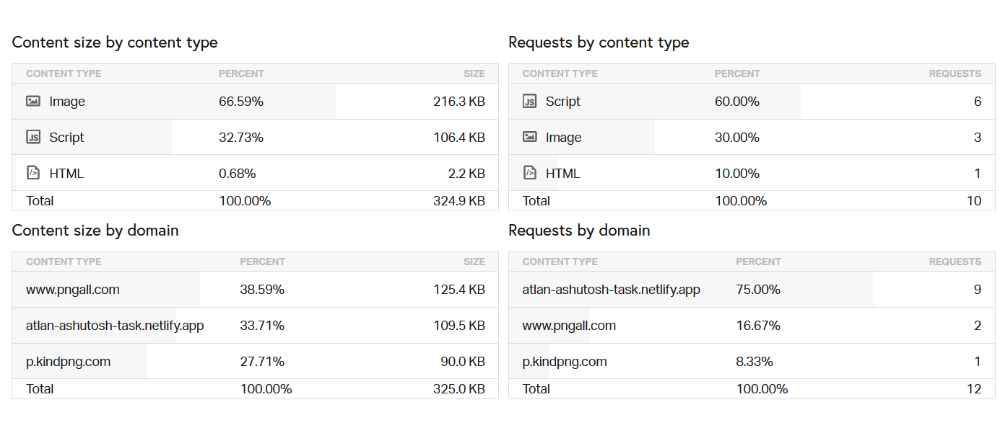

# Atlan-frontend
Atlan frontend intern 6 month challenge

### `Page load time : 2.31 seconds`
Analysis via pingdom (Japan server)

## Steps taken to improve page load time

+ PWA was added for faster load times for subsequent visits.
+ Used purgecss to get rid of components I don't use, which helped reduce the time.
+ Used png images, of considerably lower sizes than the jpg ones, which helped in faster load time.